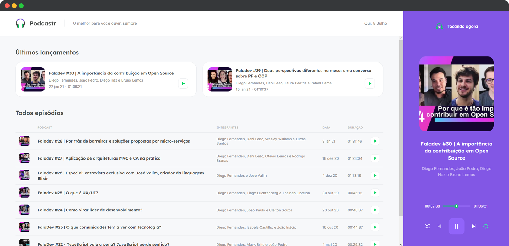

<h1 align="center">
  
</h1>

<p align="center">
  

  
</p>

<br>

<p align="center">
  
</p>

<br>

## 🧪 Tecnologias

Esse projeto foi desenvolvido com as seguintes tecnologias:

- [React](https://reactjs.org)
- [Next.js](https://nextjs.org/)
- [TypeScript](https://www.typescriptlang.org/)

## 💻 Projeto

O Podcastr é um website de reprodução de episódios em áudio perfeito para você que busca ouvir seus podcast's favoritos sobre tecnologias e assuntos de programação.

O Podcastr foi desenvolvido pensando em oferecer o funcional de forma prática e agradável, possuindo uma interface clean e moderna de fácil manuseio e utilização.

Este é um projeto desenvolvido durante a **[Next Level Week Together](https://nextlevelweek.com/)**, apresentada nos dias 19 a 25 de Abril de 2021.

## 🔖 Layout

Você pode visualizar o layout do projeto através do link abaixo:

- [Layout Web](https://www.figma.com/file/UwFEntsHpHYJlHNQAQr4gA/Podcastr/duplicate)

É necessário ter uma conta no [Figma](http://figma.com/) para acessá-lo.

## 🚀 Como executar

Clone o projeto e acesse a pasta do mesmo.

```bash
$ git clone https://github.com/rafaelramosdev/nlw-05-reactjs
$ cd nlw-05-reactjs
```

Para iniciá-lo, siga os passos abaixo:

```bash
# Instala as dependências
$ npm install

# Inicia o website
$ npm run start
```

O website estará disponível no seu navegador pelo endereço [`http://localhost:3000`](http://localhost:3000).

## 📄 Licença

Esse projeto está sob a licença MIT. Veja o arquivo [LICENSE](LICENSE) para mais detalhes.

---

Fique ligado nas próximas edições do [Next Level Week](https://nextlevelweek.com/), é um evento gratuito que você não pode deixar passar, recomendo muito!

Feito by [Rafael Ramos](https://rafaelramos.dev/) 🙋🏻‍♂️
